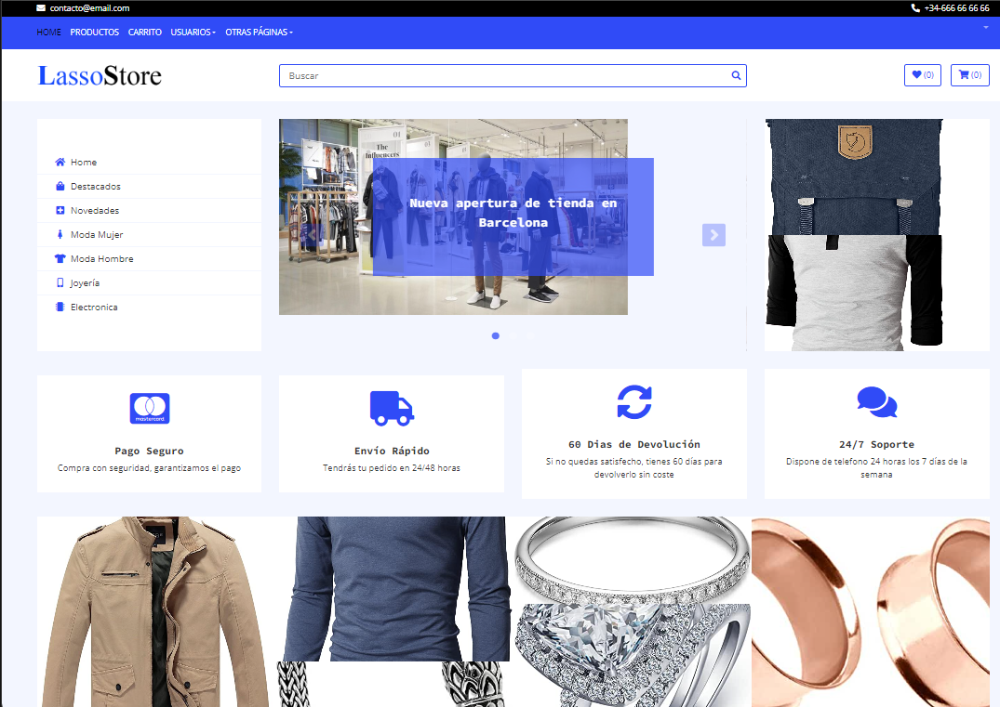
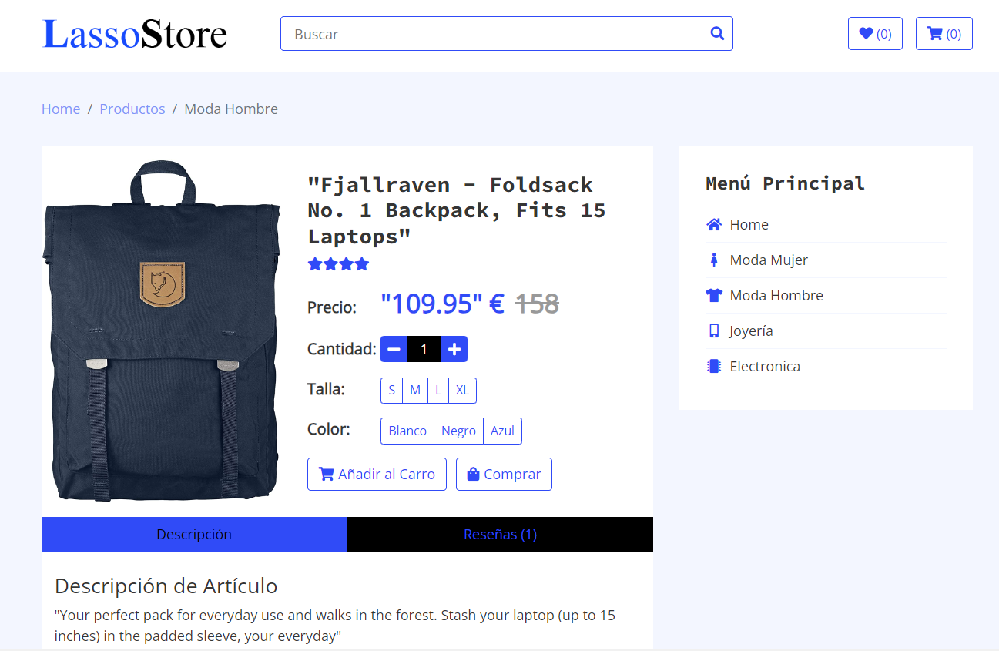
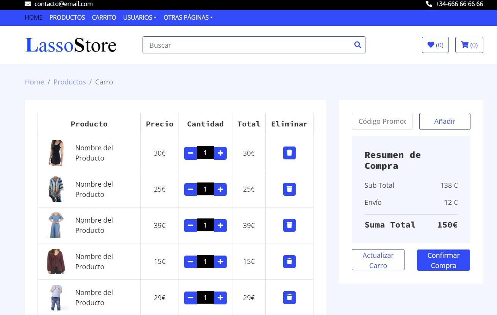

# Proyecto Personal Front

# Uso de la Api https://fakestoreapi.com/

### Proyecto de Creación de Tienda On-Line
En este proyecto se creará un e-commerce. Tendrá seccion de Novedades y Destacados en la página principal.

La API sólo ofrece 20 productos, 4 primeros de la sección de hombre, 4 siguientes de la sección de joyería, 6 de la sección de electrónica y por último 6 de la sección de mujer.

Contará con un menú superior para las páginas principales como Carro de la compra, Login de Usuario, Lista de Deseos, Contacto, etc.

Se generarán páginas separadas para las distintas llamadas a las APIs por cada categoría, la navegacón por ellas se realizará con un menú lateral. No se usará SPA.

Dentro de cada sección, los artículos disponen de las opciones de Comprar, Guardar en Favoritos o ver los detalles del artículo.
En ese apartado hay posibilidad de escribir una reseña del artículo.

### Temas Pendientes:
- El Login de Usuario, no se consigue enlazar con FireAuth (Idea de un usuario Administrador para ver gráficos de ventas)
- El Carro de la Compra y Lista de Deseos no se consigue enlazar con FireStorage
- En los productos no realiza la búsqueda por texto y faltaría que los detalles del producto saliera como articulo principal.

